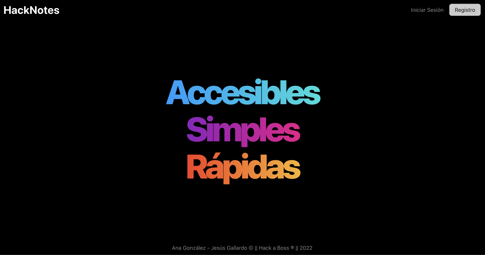

# WEB APP NOTAS

## Link preview

https://grand-pastelito-638c86.netlify.app/

## Descripción

Proyecto final para el bootcamp de **Hack A Boss**, en donde tenemos que desarrollar una **SPA** que permite la creación y gestión de notas, además de poder hacerlas públicas y compartirlas mediante la url, así como todo el backend para el correcto funcionamiento

## Tecnologías utilizadas

### Backend

- Node.js
- Express
- MySQL
- Autentificación mediante JsonWebToken
- Encriptado de datos con BCRYPT

### Frontend

- React para la SPA
- React-router-dom para el manejo de las rutas
- CSS para las hojas de estilos
